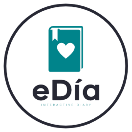

# eDía - Interactive Diary

eDía is a desktop-first, interactive JavaScript powered application.

# What is it?
eDía is an interactive app, that challenges you to reflect on yourself. Every day you can capture your mood, write down your feelings, answer questions and receive challenges that meet your individual needs. 

 The app is the journal in your pocket - It enables you to journal on a regular basis no matter where you are.

# Who is it for?

Anybody that is eager to self-improve while at the same time practise mindfulness will fall in love with eDía. It's for people who become anxious when they see blank pages. This app offers conversation starters and make you try out new ways to self-improvement.

# Why does edía exist?

Studies have shown positive effects such as improving your mood by: Helping you prioritize problems, fears, and concerns, it boost memory and comprehension, it also increases working memory capacity, which may reflect improved cognitive processing.

People being caught up in daily stress are prone to depression and burn out. and there's an increasing number of people affected.

# Framework / Tech used 

- bootstrap.com
- miro.com
- fontawesome.com
- cssgradient.io
- favicon.io
- HTML, CSS & JavaScript
- Python
- Express
- Node.JS
- MongoDB 
- FastAPI
- Figma
- Visual Studio Code

# How to use the prototype

In the repositoriy, you'll find all pages named after their respective topic, for example "entry.html" is the first page the user sees when they enter the app. The stylesheet and the script are likewise named after the corresponding HTML file, so "entry.html", "entry.css" and "entry.js" all belong together. 

However, in order to use the app correctly and to get a cohesive experience, it's only necessary to open the entry.html file on your browser and you'll be guided through the app per click. For that, please download the code to your computer in a local file.

# How to install the FastAPI

The FastAPI is the tool that allows the communication between the frontend and the machine learning service.

## Preconditions:
Python 3

## Run local:

### Install dependencies
pip install -r requirements.txt

#### Run server
uvicorn app.main:app --reload

### API documentation
http://127.0.0.1:8000/docs
or
localhost:8000/docs

# UX 

Here you'll find our [Figma file](https://www.figma.com/file/A4GUQc2muYOeyxLznIir0V/Interactive-Diary?node-id=0%3A1) and our [miro] (https://miro.com/app/board/o9J_lbj_yro=/?utm_source=notification&utm_medium=email&utm_campaign=daily-updates&utm_content=go-to-board) where we collected ideas that the prototype is based on.

s/README.md>
