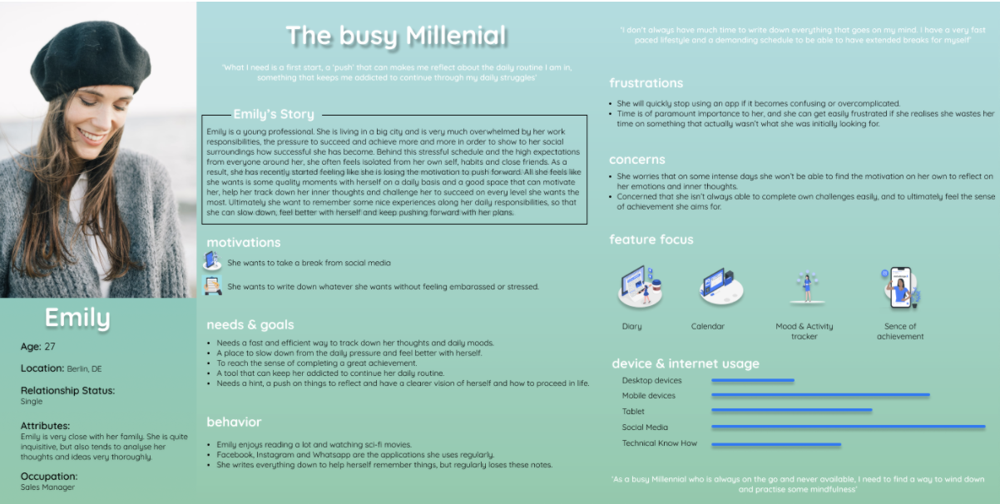
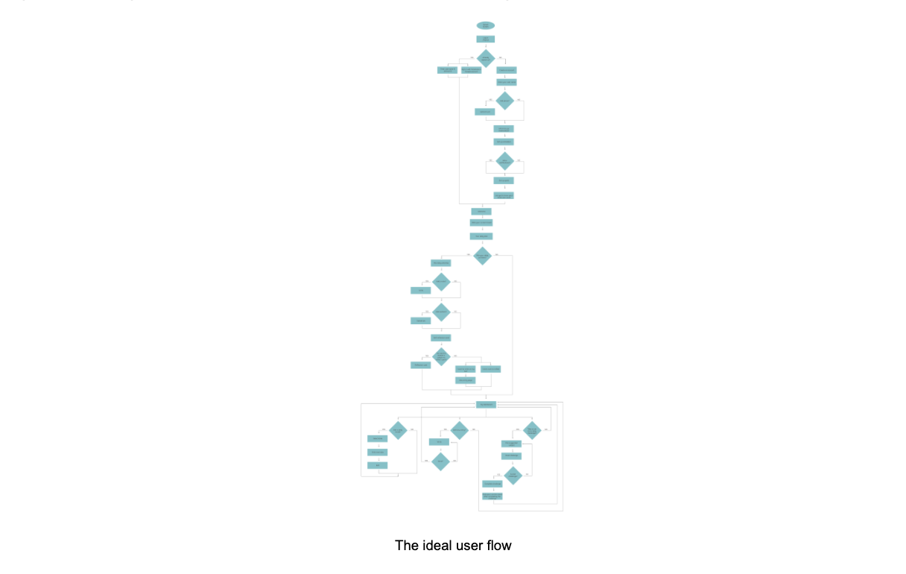
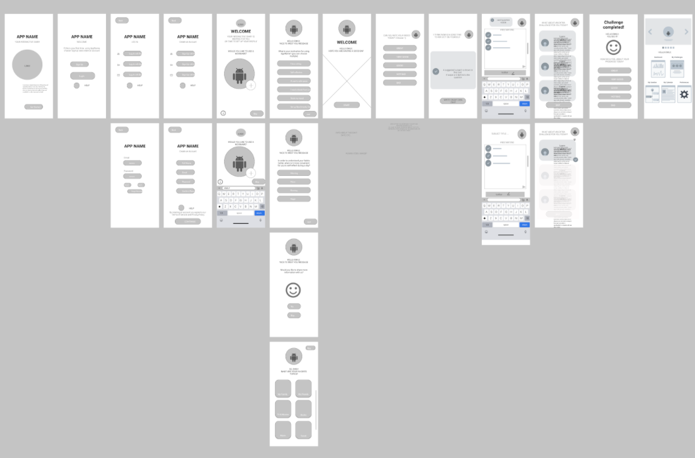
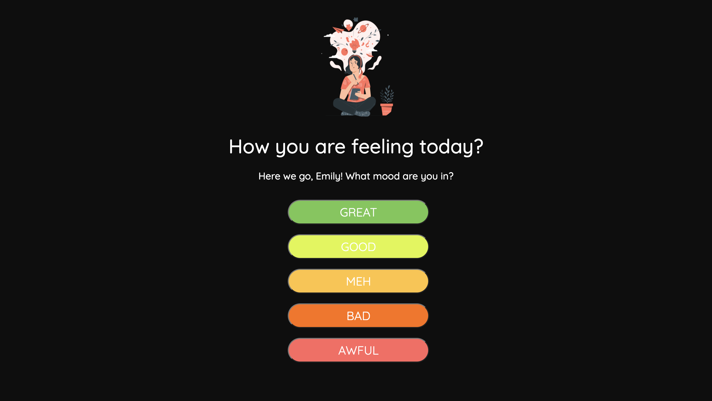
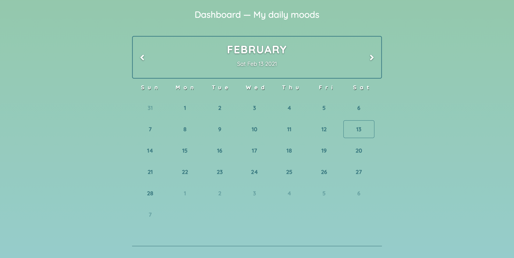
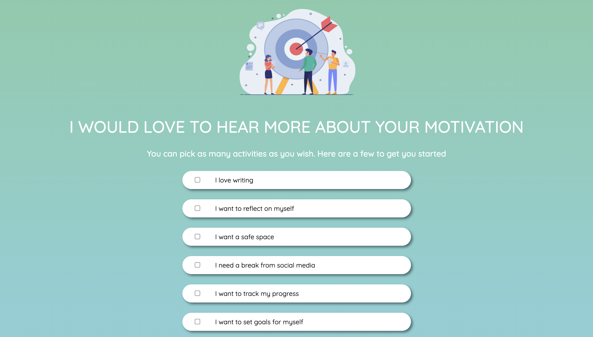

# eDía - Interactive Diary

## This project was carried out as part of the TechLabs “Digital Shaper Program” in Berlin Winter Term 2020/21

### From Research to Idea:
Covid-19 has changed our daily life and routine. People were being forced to stay at home,  meetings with people were reduced to the minimum, people were less active and bound to the couch at home. This is not only resulting in us getting more lazy, but we are also spending much more time to self-reflect and think about issues we usually do not have time for. 
With all these thoughts flying around in our head but simultaneously no one to share our thoughts with, writing them down can be a true relief, while adding daily challenges and activities to our routine are keeping our brain and body on track during lockdown. 
To facilitate people to get into writing up their thoughts and reflections on daily tasks, this web application is challenging each user to start writing by suggesting a topic based on the users preferences and characteristics. 

### From Idea to Design (UX):
Our main inspiration for this app was the well-known card game “We are not really strangers” that gives players a set of cards with dedicated questions to start conversation and self-reflection. Since it was not clear to us what form our product should have at first and how it should be designed or function, we decided as a collective group to arrange a brainstorming session with all the members of the team and track down everyone’s thoughts, ideas and expectations of how the product should function.

After the first session we agreed to attempt to transform the card game and modernise it into a digital form paired with a diary, making it more challenging and motivating for each individual and their needs, along with the shifting needs of our society that we mentioned earlier. Eventually we aimed to make this board game concept work more effectively in the digital environment and correlate it with the problem statement we had already established. At this point we had almost cleared out our problem statement. 

An important next step was to conduct a competitor analysis with similar products that exist already in the market and we attempted to pinpoint their strong ideas and strategies, along with potential gaps for our own product to flourish within the market. Based on our market research on similar apps and web applications, we recognize that there is a market for this kind of app and that in fact some similar apps are among the highest ranked apps in the app store. This gave us the confidence to move forward and identify more ways to make our own product stand out within this fierce competition.

The next steps included tracking down a business plan for our product, which involved detailing even further main questions regarding our product, ‘what is it about’, our potential users, their needs and expectations and the success criteria. Those came in forms of ‘who’, ‘what’, ‘why’ or ‘how’ and ‘when’ questions, that helped us further progress with our user research and helped us create user stories, in an attempt to explain our product. Along with the help of our team’s mentors we agreed on the one we wanted to focus on. The final summary can be seen in the dedicated user persona that we created after this process in order to sum up our main application’s goals and targets. 

 

We had another brainstorming session aimed solely at analysing the most efficient flow Emily would follow within our platform to achieve her unique goals. We planned this out in small steps, analysing her ‘ideal’ moves and overall emotions or potential frustrations and agreed all together in a main user flow and the design elements of our application. 

### The ideal user flow

At this stage we were all set up to move on with the design thinking method from the information architecture stage into the creation of wireframes, in order to show the rest of the team how we envision our product to properly function. We started with low fidelity wireframes and focused on a mobile version, since we thought that this form would respond more appropriately to the goals we have set for the product. In the end it will be a web responsive application, but we figured it would be easier for each team to track down the main elements and how the application will be designed. During our weekly meetings, we presented the versions of the product to the team, every time more coordinated with higher fidelity along with the help of Lili, our team’s tutor, and made sure to improve parts that needed further adjustments and at the same time initiate a conversation with the rest of the team members and especially the web development team on aspects of the design they would need further clarifications or assistance to start coding/ creating. We also aimed to incorporate a section within the user’s onboarding journey where team data science would collect data about the user in order to create a user type based on their behavior and to suggest more personalised questions at a later stage of the user journey.

At the end of this process and the constant updates on the frames, we tested the product with a few friends of ours to point out any areas that would need further adjustments.

Our initial frames, that acted as a springboard for further conversation with the rest of the team. 
Final version can be seen on our group file.

##### Insights:
User research is of paramount importance. You may think that you have designed the ideal product, but at the end of the day we are here to cater to the user’s needs, so our goal is to make a product that feels efficient and easy to use according to the end user’s needs.

Discussions, analysis and collaboration is important before setting out to ‘sketch’ or ‘design’ something. We understood it properly as soon as we started our collaborative work. Brainstorming sessions and hearing everyone’s thoughts and opinions of how the product should be designed helped us lay out the basic ground and understand what we were aiming to create, before moving forward and avoiding making any crucial mistakes. 

### From Design to Web Application (WD):
(Frontend) We started off by choosing the wireframe that the UX team provided which seemed the "easiest" to remodel in HTML. It turns out, what seems simple at first glance might not be the easiest to code after all. Considering the amount of time it took to do the first page, it seemed unrealistic to finish this project on time. The learning curve was steep though, so after having built 3-4 pages, you seem to get the hang of it. 

This is the first page of eDía ever built 

There were some pages that needed some extra attention and work, as they didn’t just consist of independent elements like an image "img", a headline "h1", a paragraph "p" and a button "button". For the dashboard, the survey and the activity list we had to rethink our concept of coding altogether since what we had done so far didn’t meet the requirements needed to build these pages. Coding along with some developer icons on YouTube did have a huge impact on the quality of the code.

When we are prone to think that it’s done, the app looks nice and polished, that’s when it hits us that implementing JavaScript to make the app responsive is the real challenge. It isn’t for how to center a div, it’s truly a lucky game to be browsing through stackoverflow and finding someone with the exact same problem. After all, we all want to do the same things, but everybody’s code is different and unique. So it took a while to figure out how to let a user add something to a list (setGoal.html) or to make a calendar (dashboard.js) responsive. 

(Backend) The backend of the prototype consists of authenticating user login information from the frontend into a simple API built using express, node.js, mongoose, and mongoDB. Information such as daily reflections are saved under that user’s data in the backend, while entities such as the username are posted on the frontend when needed while the user is logged in. 

This sounded pretty easy in the beginning and one would not say it was particularly difficult, however because backend development is quite abstract with many different elements that need to be accounted for, from getting used to the terminal, to installing packages, understanding different types of data, and a lot of unfamiliar vocabulary (parsing, JSON, templating, seeding, models etc…)  it took a lot longer than expected to produce something this simple. 

Nevertheless, we thoroughly enjoyed learning about the backend. It was really exciting to see the magic that happens behind the scenes that is necessary for an app to work. We heard somewhere a metaphor that HTML is the bones (structure), CSS is the skin (design), and JavaScript is the muscle … that certainly seemed to be the case from our experience. 

##### Insights: 
You can watch all videos in the world on how to code, but you’ll only learn it if you put it practise and do it over and over again In Web Development, it’s all about putting knowledge into practise

Coding can be frustrating as even the tiniest error makes your code defective and useless, so bringing that vision from talking about the diary and mapping it out to reality is a powerful step towards a finished app project

### Data as the backbone for the interactive component (DS): 
To make the eDia web application more customized to the users’ interests and give them more valuable experience when using the app, users will be given questions and challenges every day that are personalised only for them. Thus, there is nothing more important than collecting their data by asking them directly or using the help of machine learning to understand better the behavior and interests of each individual.

Starting from this idea, we created almost 200 questions and challenges. Thereafter, they were rated according to the categories that we decided beforehand, these data was saved as an excel data. It was then imported into python as pandas DataFrame to make them more visible and organised.

Every question and challenge has 7 categories which will designate them into 5 big groups. These 5 groups represent what kind of user (or ‘user type’) they are. Why only 5 user types you might ask? Because we didn’t have that many questions/challenges to start with. So we needed to reduce the number of clusters to provide more questions available in each cluster. We will provide more questions/challenges in the future and at the same time develop more user types to make the app more personal.

To learn about the users and to know into which ‘user type’ a user should be placed, we utilised the KMeans model, an unsupervised learning method. With the help of Normalizer from scikit-learn, the questions and challenges will firstly be preprocessed and then fitted into the KMeans model. After that, their target labels (or cluster) will be predicted inside the KMeans model. The performance of this model could be seen from the inertia’s value (the spread of datas from the centre of a cluster).

After the clusters were established by the model from the questions and challenges, we then predict a user’s label using their profile that was collected at his/her sign-up. This label shows us into which cluster (or ‘user type’) this particular user was placed. In the end, we will randomly choose questions or challenges that are inside this only cluster to be shown to the user. This way, the questions and challenges that are generated for the users will be more personalised to each of them.

### What we want to improve in the future:
We want to find a way to make these questions/challenges more personalised by learning the behavior of our users from the chosen questions/challenges. For example, if a user chooses a question from cluster 3 that day, their profile will be moved towards the centre of cluster 3. But, if they choose to not answer the provided question from cluster 3, they will be moved away from the cluster 3.

The same principal also works for the challenges’ part. There will be three daily challenges generated for the user every day. However, every three or four days one question from another random cluster - that the user does not belong to - will be provided as one of the three daily challenges. And if this particular user chooses to do this daily challenge that does not belong to the user’s cluster, he/she will be moved nearer towards the centre of this cluster. But of course, if this user chooses a challenge that belongs to his/her cluster, they will move nearer to it.

##### The Team:
UX: Mai Anh Doan Thi, Pavlos Zisis
WD: Bianca Dumschat, Jee In Shin
DS: Edwin Tjokro, Marina Azaredo, Yinran Yu

#### The Mentors:
Nico Duldhardt, Lili Kovac
